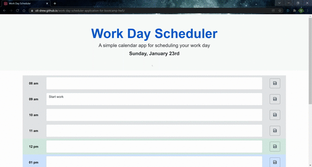

# Work Day Scheduler Application

## Description

A simple calendar application to manage your time hour by hour during the working day. The working day is split into hourly timeblocks.
These timeblocks are colour coded depending on whether they are past, present or future. The user can add events to each timeblock, these events are saved in localstorage.

The application uses JavaScript and the JQuery library to dynamically update the HTML and CSS, as well as Bootstrap 5 and Fontawesome for styling and icons. The MomentJS library is used to handle time and date.

**Technology stack:**

- HTML, CSS, and JavaScript
- JQuery
- Bootstrap 5
- MomentJS
- Fontawesome Icons
- Deployed to GitHub Pages

## Animated Screenshot

## Deployment link

https://oli-drew.github.io/work-day-scheduler-application-for-bootcamp-hw5/

## License

[MIT License](LICENSE)
